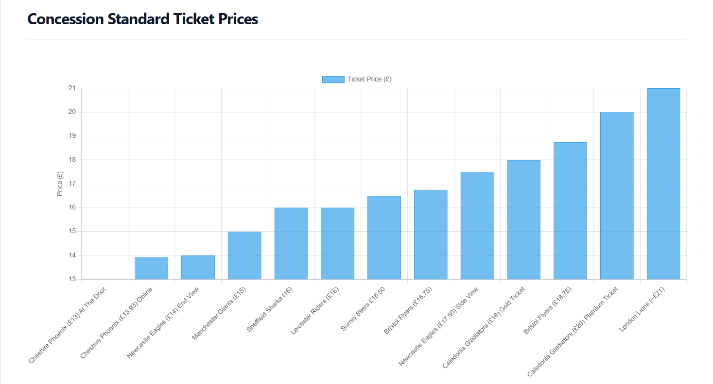

# Project 1
Documentation for my first data analytics project.

- The dataset contains 15 adult standard ticket prices across the British Basketball League. Sheffield Sharks sit at £20, which is the median price, meaning exactly half of the league is cheaper and half is more expensive. This also places the Sharks within the mode, as £20 is the most frequently occurring price in the league, shared with Leicester Riders and Newcastle Eagles.

- The mean (average) ticket price across all clubs is £21.90, placing Sheffield Sharks £1.90 below the league average. From a value for money standpoint, this positions the Sharks as a competitively priced club offering below‑average cost for a typical BBL game.

- The price range spans from £17 (Cheshire Phoenix) to £27.50 (London Lions), giving a total spread of £10.50. The interquartile range (IQR) representing the middle 50% of prices runs from £18.75 (Q1) to £23.75 (Q3). Sheffield Sharks sit comfortably within this central band, indicating that their pricing aligns with the league’s core market rather than the extremes.

- The £20–£22 bracket is the most densely populated pricing, containing four clubs. Sheffield Sharks sit at the entry point of this band, making them the most affordable option within the league’s mid‑tier pricing group.

- At the upper end, London Lions (£27.50) are a clear outlier, significantly above the rest of the league. At the lower end, Cheshire Phoenix (£17) represent the cheapest entry point. These outliers stretch the distribution but do not affect the Sharks’ position within the center.

&nbsp;
&nbsp;

- The dataset contains 13 concession standard ticket prices across the British Basketball League. Sheffield Sharks sit at £16, which places them below both the median and the mean, making them one of the better value options in the league for concession fans. They also share the mode, as £16 is the most frequently occurring concession price, matched by Leicester Riders.

- The mean (average) concession ticket price across all clubs is approximately £17.42, placing Sheffield Sharks around £1.42 below the league average. From a value for money standpoint, this positions the Sharks as a competitively priced club offering a cheaper than average entry point for younger fans, students, and other concession groups.

- The price range spans from £13 (Cheshire Phoenix) to £21 (London Lions), giving a total spread of £8. The interquartile range (IQR)  representing the middle 50% of prices runs from about £14.50 (Q1) to £18.38 (Q3). Sheffield Sharks sit below the midpoint of this band, indicating that their pricing is in the lower/middle segment of the league’s concession market.

- The £16–£18 bracket is one of the most populated clusters, containing several clubs. Sheffield Sharks sit at the entry point of this band, making them one of the most affordable options within the league’s main concession pricing group.

- At the upper end, London Lions (£21) are a clear outlier, significantly above the rest of the league. At the lower end, Cheshire Phoenix (£13) represent the cheapest concession ticket available. These outliers widen the distribution but do not affect the Sharks’ as they are still included in the central cluster.
